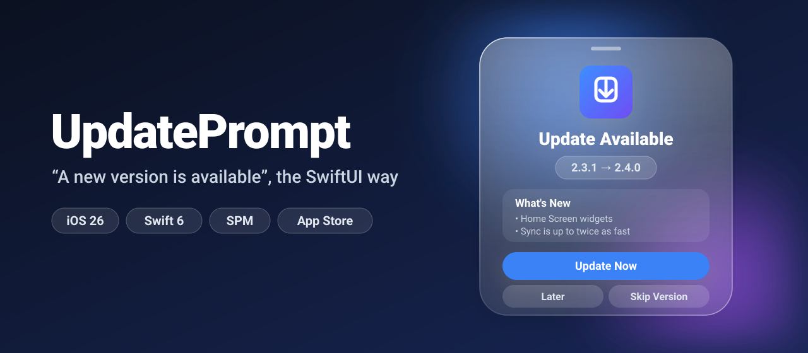
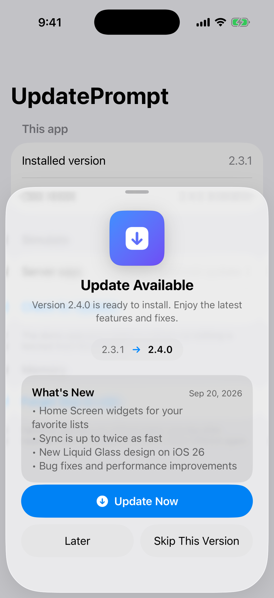
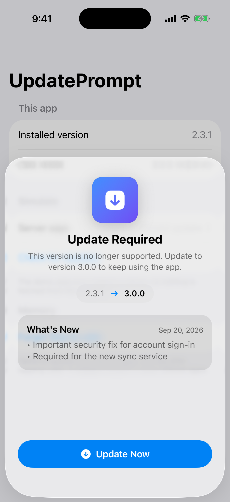
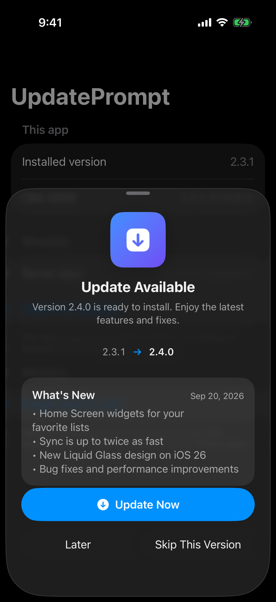

<p align="center">
  
</p>

<p align="center">
  <a href="https://github.com/halilozel1903/UpdatePrompt/actions/workflows/ci.yml"></a>
  
  
  
  
  <a href="LICENSE"></a>
</p>

**UpdatePrompt** tells your users that a newer version of your app is available, the modern SwiftUI way. It reads the App Store (or your own JSON file), decides whether to ask, and shows a native **Liquid Glass** sheet with the release notes and an *Update* button. Old versions can be **forced** to update.

One observable checker, one modifier:

```swift
@State private var updates = UpdateChecker(source: AppStoreUpdateSource())

ContentView()
    .updatePrompt(updates)
```

## Screenshots

Captured from the example app on an iOS 26 simulator by CI.

| Optional update | Forced update | Dark mode |
| :---: | :---: | :---: |
|  |  |  |

## Features

- 🛍 **App Store source** built on the public iTunes lookup API: version, release notes, release date, minimum OS and product page, no API key.
- 🧾 **Remote JSON source** for the rules the App Store cannot express, like a minimum supported version.
- 🔌 **Pluggable**: conform to `UpdateSource` to read from Firebase Remote Config or your backend, or merge several with `CombinedUpdateSource`.
- 🔢 **Correct version math**: `1.10` is newer than `1.9`, `1.0` equals `1.0.0`, and `2.0-beta.2` comes before `2.0`.
- ⛔️ **Forced updates** below a minimum version: no *Later*, no *Skip*, no swipe to dismiss.
- 🙅 **Respectful**: *Skip This Version* is remembered, *Later* waits a configurable interval, and nobody is asked to install a version their OS cannot run.
- 🧊 **Liquid Glass** sheet and buttons on iOS 26 / macOS 26, materials on iOS 17 to 18.
- 🧠 **Pure decision engine** (`UpdateDecisionEngine`) with no I/O and no clock, fully unit tested.
- 🧵 **Swift 6 strict concurrency**, `@Observable`, zero dependencies, tested with Swift Testing and JSON fixtures.

## Installation

Add the package in Xcode via **File › Add Package Dependencies…**:

```
https://github.com/halilozel1903/UpdatePrompt
```

or in `Package.swift`:

```swift
dependencies: [
    .package(url: "https://github.com/halilozel1903/UpdatePrompt", from: "1.0.0")
]
```

## Quick start

```swift
import SwiftUI
import UpdatePrompt

@main
struct MyApp: App {
    @State private var updates = UpdateChecker(source: AppStoreUpdateSource())

    var body: some Scene {
        WindowGroup {
            ContentView()
                .updatePrompt(updates)
        }
    }
}
```

That's it. The checker runs when the view appears and every time the app returns to the foreground. When a newer version is on the App Store, the sheet appears; tapping **Update Now** opens the product page through SwiftUI's `openURL`.

## Usage

### Sources

| Source | Reads | Good for |
| --- | --- | --- |
| `AppStoreUpdateSource(bundleID:country:)` | `https://itunes.apple.com/lookup?bundleId=…&country=…` | Optional updates with the real release notes |
| `RemoteJSONUpdateSource(url:)` | A JSON file you host | Forced updates, staged rollouts, non App Store builds |
| `CombinedUpdateSource(a, b, …)` | Several sources | App Store version + your minimum version |
| Your own `UpdateSource` | Anything | Remote Config, your API, tests and previews |

`bundleID` defaults to `Bundle.main` and `country` to the current region. If your app is not sold in every storefront, pass the country explicitly (for example `"tr"`), otherwise the lookup may find nothing.

### Forcing an update

Host a small JSON file, for example on GitHub Pages:

```json
{
  "latestVersion": "3.1.0",
  "minimumVersion": "3.0.0",
  "releaseNotes": "A security fix everyone needs.",
  "minimumOSVersion": "17.0",
  "updateURL": "https://apps.apple.com/app/id1234567890"
}
```

Only `latestVersion` is required. Every installed version below `minimumVersion` gets a sheet that cannot be dismissed. To keep the App Store's release notes, combine both sources; the newest version wins and the highest minimum applies:

```swift
let source = CombinedUpdateSource(
    AppStoreUpdateSource(country: "us"),
    RemoteJSONUpdateSource(url: URL(string: "https://example.com/app-version.json")!)
)
@State private var updates = UpdateChecker(source: source)
```

### Your own source

```swift
struct RemoteConfigSource: UpdateSource {
    func latestUpdate() async throws -> UpdateInfo {
        let config = try await RemoteConfig.fetch()
        return UpdateInfo(
            version: AppVersion(config.latest) ?? "0",
            minimumRequiredVersion: AppVersion(config.minimum),
            storeURL: URL(string: "https://apps.apple.com/app/id1234567890")
        )
    }
}
```

### Policy

```swift
UpdateChecker(
    source: AppStoreUpdateSource(),
    policy: .reasking(everyDays: 3, allowsSkipping: false)
)
```

| Option | Default | Meaning |
| --- | --- | --- |
| `reaskInterval` | 1 day | After *Later*, wait this long before asking again |
| `allowsSkipping` | `true` | Show *Skip This Version* and honor it |

### How the decision is made

`UpdateDecisionEngine.decide(update:currentVersion:osVersion:state:policy:now:)` is a pure function. Rules, in order:

| # | Condition | Decision | Prompt |
| --- | --- | --- | --- |
| 1 | Newer version needs a newer OS than the device has | `.unsupportedOS` | No |
| 2 | Installed version is below `minimumRequiredVersion` | `.required` | Forced |
| 3 | Store version is not newer than the installed one | `.upToDate` | No |
| 4 | The user skipped exactly this version | `.skipped` | No |
| 5 | The user was asked less than `reaskInterval` ago | `.postponed(until:)` | No |
| 6 | Otherwise | `.available` | Optional |

### Checking manually

```swift
@State private var updates = UpdateChecker(source: AppStoreUpdateSource())

ContentView()
    .updatePrompt(updates, checksAutomatically: false)

// For example from a "Check for Updates" button:
Button("Check for Updates") {
    Task {
        let decision = await updates.check()
        if decision == .upToDate { showUpToDateAlert = true }
    }
}
```

`UpdateChecker` is `@Observable`, so `decision`, `offer`, `isChecking` and `lastError` can drive your own UI. The modifier also puts the checker into the environment: `@Environment(UpdateChecker.self)`.

### Versions

```swift
let installed: AppVersion = "1.9"
AppVersion("1.10") > installed           // true
AppVersion("1.0") == AppVersion("1.0.0")  // true
AppVersion("2.0-beta.2") < "2.0"          // true
AppVersion(serverString)                  // AppVersion? — nil when invalid
```

> **Note:** `AppVersion` is `ExpressibleByStringLiteral`, so `AppVersion("2.0")` written with a *literal* is not optional (an invalid literal traps). Parsing a `String` variable, for example from a server, uses the failable initializer and returns `nil` for invalid input.

### Testing

Every dependency can be injected:

```swift
let checker = UpdateChecker(
    source: AppStoreUpdateSource(bundleID: "com.example.app", transport: HTTPTransport { request in
        (fixtureData, HTTPURLResponse(url: request.url!, statusCode: 200, httpVersion: nil, headerFields: nil)!)
    }),
    currentVersion: "2.3.1",
    osVersion: "26.0",
    store: InMemoryUpdatePromptStore(),
    now: { fixedDate }
)
```

Both network sources also accept a `URLSession`, for example one configured with a custom `URLProtocol`.

## How it looks on each OS

| | iOS 26 / macOS 26 | iOS 17 – 18 / macOS 14 – 15 |
| --- | --- | --- |
| Sheet | System Liquid Glass sheet at a partial height | `.regularMaterial` presentation background |
| Buttons | `.glassProminent` and `.glass` | `.borderedProminent` and `.bordered` |
| Version badge | `glassEffect(.regular)` capsule | `.thinMaterial` capsule |

## Example app

The `Example` folder contains a demo app with an in-memory fake source, so you can try optional, forced, up-to-date and unsupported-OS answers without a network. It uses [XcodeGen](https://github.com/yonaskolb/XcodeGen) so no project file has to live in the repo:

```bash
brew install xcodegen
cd Example && xcodegen generate
open UpdatePromptDemo.xcodeproj
```

## Requirements

- Xcode 26 or later (Swift 6.2 toolchain)
- iOS 17+ / macOS 14+ (Liquid Glass automatically on 26+)

## Contributing

Issues and pull requests are welcome. Please run `swift test` before opening a PR.

## License

UpdatePrompt is available under the MIT license. See [LICENSE](LICENSE).
